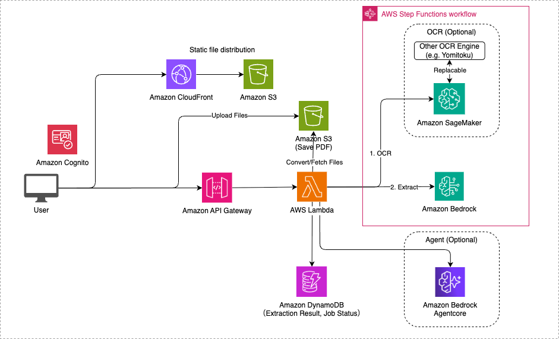
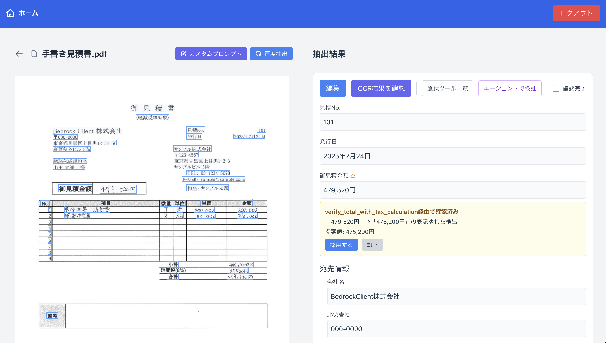

# AutoExtract

AutoExtract は OCR + Bedrock を活用した帳票読み取りの AI-OCR ソリューションです。帳票からの情報抽出を半自動化し、人間によるデータ入力チェックをサポートするツールです。

デモ


## アーキテクチャ



## デプロイ手順

デプロイの際は、事前に Node.js、Docker のインストールが必要です。

#### 使用するモデルの変更

`cdk.json` にて、使用する Bedrock モデルの ID とリージョンを指定することができます。モデルの ID は [Amazon Bedrock でサポートされている基盤モデル](https://docs.aws.amazon.com/ja_jp/bedrock/latest/userguide/models-supported.html) を参照してください。また、使用するモデルを変更する場合は、上記のステップと同様にモデルアクセスを有効化する必要があります。

```
"model_id": "us.anthropic.claude-sonnet-4-20250514-v1:0",
"model_region": "us-east-1",
```

#### OCR エンジンへの変更(PaddleOCR or DeepSeek OCR)

`cdk.json` にて、使用する OCR エンジンを指定することができます。

```
"ocr_engine": "paddle",  // "paddle" または "deepseek"
```

- `paddle`: PaddleOCR（デフォルト）
- `deepseek`: DeepSeek OCR

### CDK による AWS リソースのデプロイ

CDK デプロイの際に必要な依存パッケージのインストールします。

```sh
npm ci
```

新規の AWS アカウント/リージョンで初めて CDK を使用する場合は、以下のコマンドを実行してください。

```sh
cdk bootstrap
```

AWS リソースのデプロイを行います。リソースの変更を行った際は毎回このコマンドを実行してください。

```sh
cdk deploy
```

デプロイ後に出力される `OcrAppStack.WebConstructCloudFrontURL` の URL にアクセスすることで、Web サイトにアクセスできます。

### AWS リソースの削除

削除するとリソースとデータは完全に消去されるので注意してください。

```sh
cdk destroy
```

### SageMaker インスタンスのゼロスケーリング

本アプリケーションでは、OCR 処理に使用する GPU インスタンスのコストを削減するため、一定時間アクセスがない場合に自動的にインスタンス数を 0 にスケールダウンする機能を実装しています。再度 OCR 処理が必要になった際は、インスタンスの起動に約 10 分程度の時間がかかるため注意してください。

`cdk.json` にて、ゼロスケーリング機能の設定を変更することができます。

```
"sagemaker_zero_scale": true,
"sagemaker_scale_in_cooldown_seconds": 3600
```

- `sagemaker_zero_scale`: ゼロスケーリング機能の有効/無効（デフォルト: `true`）
- `sagemaker_scale_in_cooldown_seconds`: スケールダウンまでの待機時間（秒）（デフォルト: `3600` = 1時間）

## 高精度日本語 OCR エンジンへの変更

デフォルトでは OCR エンジンとして PaddleOCR を利用していますが、高精度の日本語 OCR エンジン「Yomitoku」に切り替えることも可能です。Yomitoku の場合は、[AWS Marketplace](https://aws.amazon.com/marketplace/pp/prodview-64qkuwrqi4lhi) からサブスクライブした後、利用することが可能です。利用方法としては、[ocr.py](lambda/api/app/ocr.py#L36) における SageMaker Endpoint の呼び出しにおいて、Yomitoku の SageMaker Endpoint を指定します。また、[Inference Component](lambda/api/app/ocr.py#L40) の記述をコメントアウトする必要があります。DeepSeek OCR に切り替えたい場合は、[OCR エンジンへの変更(PaddleOCR or DeepSeek OCR)](#ocr-エンジンへの変更paddleocr-or-deepseek-ocr) をご参照ください。

また、GitHub で公開されている [Yomitoku](https://github.com/kotaro-kinoshita/yomitoku) を利用して、本サンプルを動作させることも可能です。実装例については[こちら](https://github.com/gteu/sample-auto-extract-ai-ocr-app)を参照してください。

> [!Warning]
>
> GitHub 版の Yomitoku は CC BY-NC-SA 4.0 ライセンスが適用されます（[詳細](https://github.com/kotaro-kinoshita/yomitoku?tab=readme-ov-file#license)）。このライセンスでは商用利用が制限されているため、ご注意ください。

## AI Agent による情報検証機能（Experimental）



本システムでは、Amazon Bedrock AgentCore を活用した AI Agent による抽出結果の自動検証・補正機能を実験的に提供しています。例えば、Agent は抽出された情報を既存の顧客データベースと照合し、不整合や欠損を自動検出して修正候補を提案します。金額の計算ミスや必須項目の抜け漏れなども自動チェックし、従来の手作業による確認作業と比較して処理時間の短縮と精度向上を実現します。

利用の際は、`cdk.json` にて、agent 機能を有効化することができます。デフォルトでは無効化されています。`enable_agent` を `true` にすることで、エージェント機能自体を有効化、`enable_agent_demo` を true にすることで、デモ用のユースケースとツールが自動的に登録されます。自動で作成された「(demo)請求書」というユースケースから、[サンプル帳票](demo/sample_invoice.pdf) をアップロードすることで、エージェント機能の挙動を確認することができます。

```
"enable_agent": true,
"enable_agent_demo": true,
```

### 開発方法

#### ローカルでの開発手順

1. 環境変数の設定

`cdk deploy` コマンドの実行後、出力されるリソース情報を利用してアプリケーションの環境変数を設定します。

出力例:

```
Outputs:
OcrAppStack.ApiApiEndpointE2C5D803 = https://XXXXXXXXXXXX.execute-api.us-east-2.amazonaws.com/prod/
OcrAppStack.ApiDocumentBucketName14F33E89 = ocrappstack-apidocumentbucket1e0f08d4-XXXXXXXXXXXX
OcrAppStack.ApiImagesTableName87FC28D3 = OcrAppStack-DatabaseImagesTable3098F792-XXXXXXXXXXXX
OcrAppStack.ApiJobsTableName16618860 = OcrAppStack-DatabaseJobsTable7C20F61C-XXXXXXXXXXXX
OcrAppStack.ApiOcrApiEndpoint94C64180 = https://XXXXXXXXXXXX.execute-api.us-east-2.amazonaws.com/prod/
OcrAppStack.AuthUserPoolClientId8216BF9A = XXXXXXXXXXXX
OcrAppStack.AuthUserPoolIdC0605E59 = us-east-2_XXXXXXXXXXXX
OcrAppStack.DatabaseImagesTableName88591548 = OcrAppStack-DatabaseImagesTable3098F792-XXXXXXXXXXXX
OcrAppStack.DatabaseJobsTableNameFCF442A2 = OcrAppStack-DatabaseJobsTable7C20F61C-XXXXXXXXXXXX
OcrAppStack.DatabaseSchemasTableNameCF14F20C = OcrAppStack-DatabaseSchemasTable97CF304A-XXXXXXXXXXXX
OcrAppStack.OcrEndpointDockerImageUriDFE2281D = XXXXXXXXXXXX.dkr.ecr.us-east-2.amazonaws.com/cdk-hnb659fds-container-assets-XXXXXXXXXXXX-us-east-2:XXXXXXXXXXXX
OcrAppStack.OcrEndpointSageMakerEndpointName031E6036 = OcrEndpointEFA18CB8-XXXXXXXXXXXX
OcrAppStack.OcrEndpointSageMakerInferenceComponentNameAD008265 = ocr-inference-component
OcrAppStack.OcrEndpointSageMakerRoleArn4F9772E2 = arn:aws:iam::XXXXXXXXXXXX:role/OcrAppStack-OcrEndpointSageMakerExecutionRoleF2F0DF-XXXXXXXXXXXX
OcrAppStack.WebConstructCloudFrontURL2550F65B = https://XXXXXXXXXXXX.cloudfront.net
Stack ARN:
arn:aws:cloudformation:us-east-2:XXXXXXXXXXXX:stack/OcrAppStack/XXXXXXXXXXXX-XXXX-XXXX-XXXX-XXXXXXXXXXXX
```

この出力情報を基に、プロジェクトルートの `web` ディレクトリにある `.env.sample` ファイルを参考にして、新規に `.env` ファイルを作成します。

2. 環境変数ファイルの設定例

`.env.sample` ファイルをコピーして `.env` ファイルを作成し、以下のように `cdk deploy` の出力値を使って設定します：

```properties
VITE_APP_USER_POOL_CLIENT_ID=XXXXXXXXXXXX                # AuthUserPoolClientId の値
VITE_APP_USER_POOL_ID=us-east-2_XXXXXXXXXXXX            # AuthUserPoolId の値
VITE_APP_REGION=us-east-2                               # リージョン名（デプロイしたリージョン）
VITE_API_BASE_URL=https://XXXXXXXXXXXX.execute-api.us-east-2.amazonaws.com/prod/   # ApiOcrApiEndpoint の値
VITE_ENABLE_OCR=true                                    # OCR機能の有効化
VITE_ENABLE_AGENT=true                                  # Agent機能の有効化
VITE_SYNC_BUCKET_NAME=XXXXXXXXXXXX                      # S3同期バケット名
```

3. ローカル開発サーバーの起動

環境変数の設定が完了したら、以下のコマンドでローカル開発サーバーを起動できます：

```bash
cd web
npm install
npm run dev
```

ブラウザで `http://localhost:3000` を開くと、アプリケーションにアクセスできます。

## Security

See [CONTRIBUTING](CONTRIBUTING.md#security-issue-notifications) for more information.

## License

This library is licensed under the MIT-0 License. See the LICENSE file.
